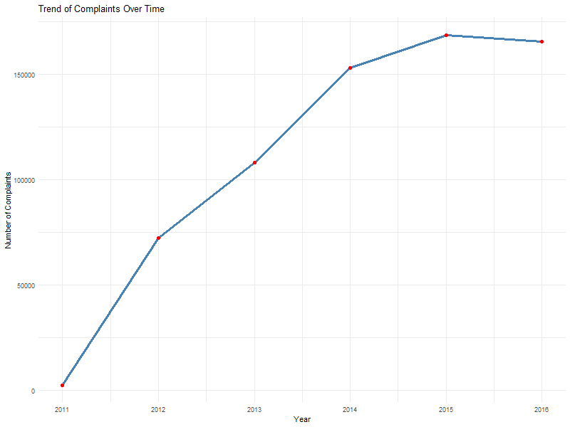
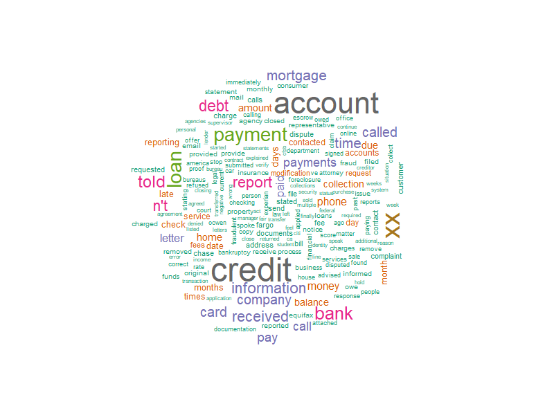
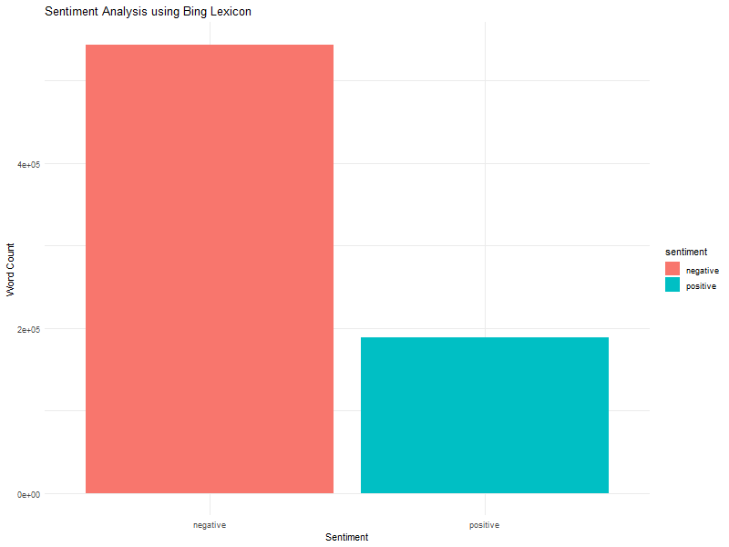
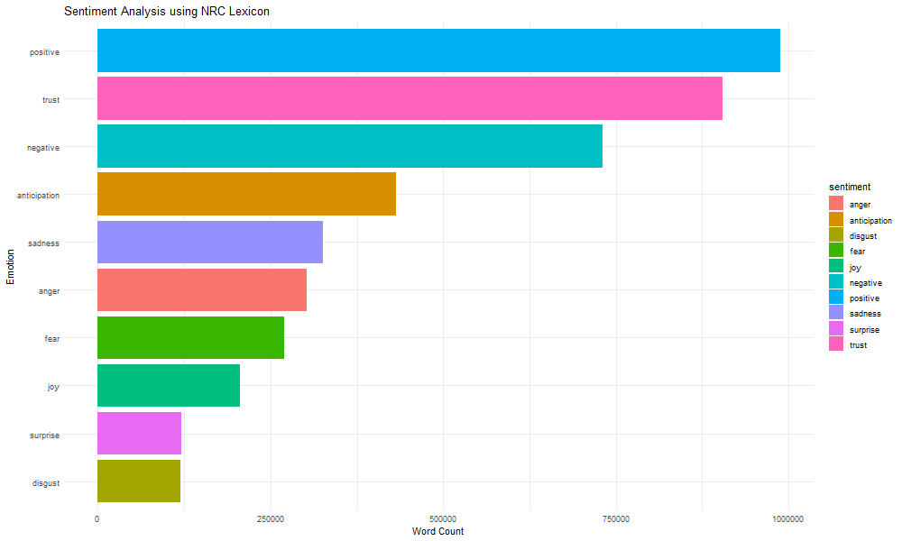
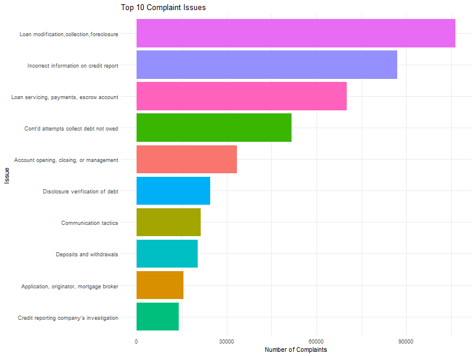
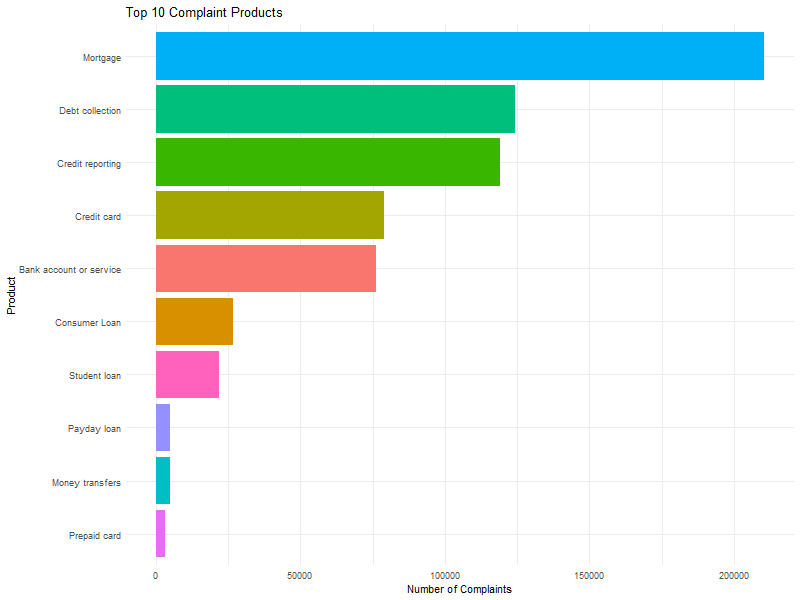

# 📊 Consumer Complaints Analysis

## Contributor ✍️  
Naby Karki

---

## Introduction  
In this project, we explore consumer complaint narratives collected by the Consumer Financial Protection Bureau (CFPB). Our goal is to gain insights into trends over time, identify the most common complaint issues and products, and examine the sentiment expressed by consumers. Through data cleaning, sentiment analysis, and various visualizations, we aim to reveal meaningful patterns in consumer concerns regarding financial services.


---

## Dictionary 📚  

The following columns from the dataset were used in the analysis:

1. **Complaint ID**: Unique identifier for each individual complaint.
2. **Product**: Financial product or service associated with the complaint.
3. **Issue**: Specific problem reported by the consumer.
4. **Date Received**: Date when the complaint was submitted.
5. **Consumer Complaint Narrative**: Narrative description of the consumer's issue.

---

## Data Cleaning 🧹

1. Filter Non-Empty Narratives:
- Removed rows where complaint narratives are empty to focus on relevant data.
```r
complaints_clean <- complaints %>%
  filter(!is.na(Consumer.complaint.narrative))
```

2. Remove Placeholder Words:
- Removed rows containing the word 'xxxx'.
```r
complaints_clean <- complaints_clean %>%
  filter(!str_detect(tolower(Consumer.complaint.narrative), "\\bxxxx\\b"))
```

3. Text Normalization:
- Converted text to lowercase, removed stopwords, numbers, and punctuation.
```r
cleaned_narratives <- complaints_clean %>%
  unnest_tokens(word, Consumer.complaint.narrative) %>%
  anti_join(stop_words) %>%
  filter(!str_detect(word, "^[0-9]+$")) %>%
  filter(word != "xxxx")
```


4. **Exporting Cleaned Data**
   - The cleaned narrative data was exported as a CSV file for documentation and reproducibility.
```r
write.csv(cleaned_narratives, "Cleaned_Narratives.csv", row.names = FALSE)
```

---

## Visualizations & Analysis

### 1. Trend of Complaints Over Time  
<div align="center">

</div>

**Why this graph was chosen:**  
A line graph is the best choice to visualize time-based trends, making it easier to observe changes in complaint volume over several years.

**Observation:**  
The number of complaints shows a sharp rise from 2011 to 2015, reaching a peak in 2015. This significant growth period reflects increasing consumer awareness and reporting behavior, possibly influenced by regulatory changes or broader economic factors such as post-recession financial instability. After 2015, there is a slight decline, potentially indicating improved consumer protection practices or saturation in complaint submissions.

---

### 2. Word Cloud of Complaint Narratives  
<div align="center">

</div>

**Why this graph was chosen:**  
A word cloud is ideal for visually emphasizing the most frequently used terms in unstructured narrative text, providing a quick and intuitive sense of key topics.

**Observation:**  
Dominant terms such as **account**, **credit**, **payment**, **report**, **loan**, and **debt** stand out, suggesting that consumers are primarily concerned with credit management, payment processing, and loan handling. The prominence of words like **bank**, **information**, and **mortgage** further highlights critical areas in financial services where customers face issues.

---

### 3. Sentiment Analysis   
<div align="center">

</div>

**Why this graph was chosen:**  
A bar chart is effective in showing categorical comparisons, and the Bing lexicon classifies words strictly as either positive or negative, making it suitable to measure overall sentiment polarity.

**Observation:**  
The analysis reveals a clear dominance of **negative sentiment**, accounting for the majority of the words used in the complaint narratives. This outcome aligns with expectations, as consumer complaints naturally highlight dissatisfaction. The relatively low volume of positive words indicates that consumers rarely include favorable experiences when submitting complaints.

---

### 4. Sentiment Analysis using NRC Lexicon  
<div align="center">

</div>

**Why this graph was chosen:**  
A horizontal bar chart enables easy comparison across multiple emotional categories, while the NRC lexicon provides a more nuanced understanding of emotions beyond positive or negative sentiment.

**Observation:**  
The **positive** and **trust** categories appear prominently, despite the prevalence of **negative** sentiment. Interestingly, emotions such as **anger**, **sadness**, and **anticipation** are also significantly represented, reflecting the frustration, concern, and uncertainty consumers experience when dealing with financial services. This breakdown gives a deeper emotional understanding of the complaints beyond mere polarity.

---

### 5. Top 10 Complaint Issues  
<div align="center">

</div>

**Why this graph was chosen:**  
A horizontal bar chart effectively displays the relative frequency of different complaint issues, allowing clear visualization of the most reported problems.

**Observation:**  
The most reported issues include **Loan modification, collection, foreclosure**, followed closely by **Incorrect information on credit reports** and **Loan servicing, payments, escrow account**. These results highlight systemic challenges in the loan and credit sectors, particularly regarding payment processing and debt collection practices. Such recurring issues suggest potential areas for regulatory intervention or service improvement.

---

### 6. Top 10 Complaint Products  
<div align="center">

</div>

**Why this graph was chosen:**  
A horizontal bar chart clearly shows which financial products receive the most complaints, enabling straightforward comparison across categories.

**Observation:**  
**Mortgages** emerge as the most complained-about product, followed by **Debt collection** and **Credit reporting**. This emphasizes the significant role mortgages and debt-related products play in consumer dissatisfaction. Notably, **Credit cards** and **Bank accounts/services** also appear frequently, indicating potential pain points in day-to-day financial products that affect a broad consumer base.

---

## Tools & Libraries Used 🛠️  

- `tidyverse`
- `tidytext`
- `wordcloud`
- `ggplot2`
- `RColorBrewer`
- `syuzhet`
- `lubridate`

---

## Conclusion ✅  

Through a detailed exploration of consumer complaint data, the analysis identifies key financial products and issues that consistently generate negative consumer experiences. The combination of time trend analysis, sentiment breakdown, and product/issue frequency visualization provides a comprehensive view of consumer pain points. Notably, complaints around mortgage services, debt collection, and credit reporting stand out as areas warranting particular attention from policymakers and service providers. Sentiment analysis confirms the overwhelmingly negative nature of these complaints, with emotions such as anger, sadness, and trust playing significant roles in the narratives.

---

## Project Structure 📂  

```
├── Consumer_Complaints_Analysis.R
├── Cleaned_Narratives.csv
└── Images
    ├── complaints_over_time.png
    ├── sentiment_bing.png
    ├── sentiment_nrc.png
    ├── top_issues.png
    ├── top_products.png
    └── wordcloud.png
```
